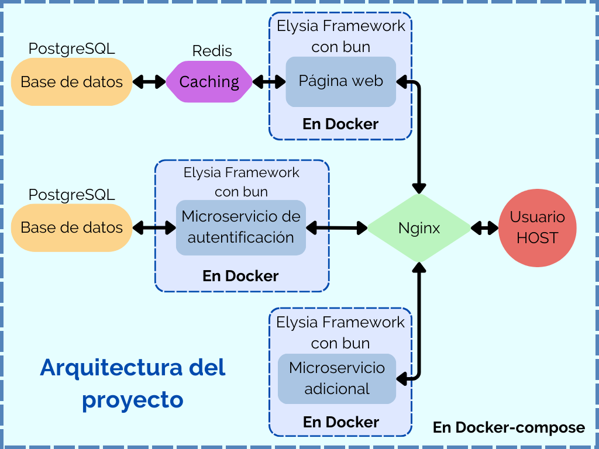

# Proyecto de Arquitectura Docker con ElysiaJS, PostgreSQL, Redis y Nginx

Este proyecto configura un entorno basado en Docker que incluye una aplicación web utilizando ElysiaJS con Bun, dos bases de datos PostgreSQL, un microservicio de autenticación, un microservicio de estado del sistema, una capa de caching con Redis, y Nginx como proxy inverso, orquestados mediante Docker Compose.

## Diagrama del Proyecto


### Detalles de la Arquitectura
En el diagrama se puede observar cómo los diferentes componentes del proyecto interactúan entre sí:
- El **Usuario** accede al proyecto mediante su navegador (HOST), enviando solicitudes a **Nginx**.
- **Nginx** se encarga de redirigir las solicitudes al servicio correspondiente según la ruta especificada:
  - `/`, `/login` o `/register` -> **Web App**.
  - `/auth/*` (login o register) -> **Auth Service**.
  - `/status` -> **System Status Service**.
- La **Web App** y el **Auth Service** interactúan con sus respectivas bases de datos en **PostgreSQL**.
- **Redis** se usa como sistema de caching para la **Web App**.

### Flujo de Datos - JWT y Autenticación
Cuando un usuario realiza un inicio de sesión, la **Web App** envía la solicitud al **Auth Service**. Si la autenticación es exitosa, el **Auth Service** devuelve una **cookie** que contiene un **token JWT** junto con los datos del usuario. En caso de error (credenciales incorrectas), se devuelve un mensaje de error (internamente) y no se otorga acceso al usuario.

## Requisitos previos

- Docker y Docker Compose instalados en el sistema.
- Puertos disponibles: `8080` (Nginx), `3000` (Web App), `4000` (Auth Service), `5000` (System Status), `6380` (Redis).

## Estructura del proyecto

El proyecto está compuesto por los siguientes servicios:

1. **Web App**: Aplicación web utilizando ElysiaJS con Bun, conectada a una base de datos PostgreSQL y utilizando Redis como sistema de caching.
2. **Auth Service**: Microservicio de autenticación que gestiona registros e inicios de sesión, retornando un token JWT.
3. **System Status Service**: Microservicio que devuelve el estado de los servicios dentro del proyecto.
4. **Nginx**: Proxy inverso que direcciona las solicitudes a los servicios correspondientes.
5. **PostgreSQL**: Dos bases de datos PostgreSQL, una para la aplicación web y otra para el servicio de autenticación.
6. **Redis**: Sistema de caching utilizado por la aplicación web para mejorar la eficiencia de las consultas.

## Configuración de los servicios

### 1. Web App (ElysiaJS con Bun)
- Ubicación: `./elysia-web-app`
- Utiliza el framework ElysiaJS ejecutado con Bun.
- Configuración de base de datos: se conecta a PostgreSQL.
- Redis se utiliza para caching.

### 2. Auth Service (Servicio de autenticación)
- Ubicación: `./auth-service`
- Permite registrar y autenticar usuarios utilizando JWT.
- Utiliza su propia instancia de PostgreSQL para almacenar usuarios.
- **Script de inicialización**: `init_auth.sql` se utiliza para inicializar la tabla `users` en la base de datos `auth_service`. El script crea la tabla si no existe:
  ```sql
  -- Conectar a la base de datos `auth_service`
  \connect auth_service;

  -- Crear la tabla `users` si no existe
  CREATE TABLE IF NOT EXISTS users (
    id SERIAL PRIMARY KEY,
    username VARCHAR(255) UNIQUE NOT NULL,
    password VARCHAR(255) NOT NULL,
    token VARCHAR(255)
  );
  ```

### 3. System Status Service
- Ubicación: `./system-status`
- Proporciona el estado de los servicios (web, autenticación, base de datos, Redis).

### 4. Nginx
- Ubicación: `./nginx/nginx.conf`
- Actúa como un proxy inverso, redirigiendo el tráfico HTTP a los servicios correspondientes.

### 5. PostgreSQL
- **Base de datos Web**: `elysia_app` para la aplicación web.
- **Base de datos Auth**: `auth_service` para el servicio de autenticación.

### 6. Redis
- Utilizado por la aplicación web para caching de datos.

## Instrucciones para ejecutar el entorno

1. Clonar el repositorio del proyecto:
   ```bash
   git clone https://github.com/tuusuario/systems-administration_docker-compose.git
   cd systems-administration_docker-compose
   ```
2. Construir y levantar los contenedores con Docker Compose:
   ```bash
   docker-compose up --build
   ```
3. Acceder a la aplicación web a través de `http://localhost:8080`.

## Probar los servicios

### 1. Web App
- Acceder a `http://localhost:8080` para ver la página principal.
- Se requiere autenticación para acceder al contenido principal.

### 2. Auth Service
- Registrar un usuario:
  - Terminal:
  ```bash
  curl -X POST http://localhost:8080/auth/register -H "Content-Type: application/json" -d '{"username": "usuario", "password": "contraseña"}'
  ```
  - Web:
    - Acceder a través de `http://localhost:8080/register` y completar el formulario.

- Iniciar sesión:
  - Terminal:
  ```bash
  curl -X POST http://localhost:8080/auth/login -H "Content-Type: application/json" -d '{"username": "usuario", "password": "contraseña"}'
  ```
  - Web:
    - Acceder a través de `http://localhost:8080/login` y completar el formulario.

### 3. System Status
- Verificar el estado de los servicios:
  - Terminal:
  ```bash
  curl http://localhost:8080/status
  ```
  - Web:
    - Una vez logeado, se podrá acceder a la página principal `http://localhost:8080/` donde aparecerá la información en una tabla en caso de funcionar correctamente.

## Funcionamiento de la página web
La página principal está disponible en `http://localhost:8080/`. Para acceder a ella, primero debe iniciar sesión. Si no está autenticado, será redirigido automáticamente a `/login`, donde podrá iniciar sesión o registrarse si no tiene una cuenta. Una vez autenticado, podrá acceder a `/`, donde se mostrará el resultado de un `SELECT NOW()` para verificar la conexión con la base de datos, junto con un mensaje de estado de los servicios del sistema.

## Notas adicionales
- **Variables de entorno**: Las credenciales de base de datos, la clave JWT y la configuración de Redis se configuran mediante variables de entorno en el archivo `docker-compose.yml`.
- **Caching**: Redis se utiliza para almacenar datos en caché y mejorar la eficiencia de las consultas frecuentes.
- **Nginx**: Se utiliza como proxy inverso para dirigir el tráfico a los servicios correctos, asegurándose de que las solicitudes sean gestionadas adecuadamente.
- **Puertos**: Asegúrese de que los siguientes puertos estén disponibles:
  - `8080`: Nginx (página principal; mapeado desde `80` del contenedor).
  - `3000`: Web App.
  - `4000`: Auth Service.
  - `5000`: System Status Service.
  - `6380`: Redis (mapeado desde `6379` del contenedor).
- **Configuración del servicio Redis y Nginx**: Redis se conecta al contenedor web-app y está configurado en el `docker-compose.yml` con el puerto `6380` (exponiendo el `6379` interno) para evitar conflictos con una instalación local. Este mismo caso ocurre con Nginx, donde se mapea al puerto 8080 por la misma razón.
- **Versión de las imágenes**: Se utiliza `postgres:latest` y `redis:latest`.
- **Dockerfiles y Dependencias**:
  - **Web App Dockerfile**: Basado en `oven/bun:1`. Expone el puerto `3000` y utiliza Bun para gestionar las dependencias (`bun install`).
  - **Auth Service Dockerfile**: Similar al de Web App, basado en `oven/bun:1`, expone el puerto `4000` y también usa Bun.
  - **System Status Dockerfile**: Basado en `oven/bun:1`. Expone el puerto `5000` y usa Bun para gestionar las dependencias.
  - **Dependencias principales**:
    - `elysia`, `jsonwebtoken`, `pg` y `ioredis` para la Web App.
    - `elysia`, `jsonwebtoken` y `pg` para el Auth Service.
    - `elysia` para el System Status.

## Posibles errores o problemas
- **Inicialización de la base de datos**: Es posible que, al ejecutar `docker-compose up --build` por primera vez, se produzca un error debido a que las bases de datos aún no se han creado. En este caso, detenga la ejecución (`Ctrl+C`) y vuelva a ejecutar `docker-compose up --build`. Este problema ocurre porque la base de datos tarda en inicializarse antes de que los servicios que dependen de ella estén disponibles.

## Problemas y dificultades en el desarrollo
Desarrollar este proyecto presentó varios desafíos, principalmente debido al uso de un framework nuevo para mí: **ElysiaJS**. Esta elección ralentizó considerablemente la entrega de resultados, ya que tuve que aprender sobre la marcha. Afortunadamente, conté con la asistencia de mi amigo **ChatGPT**, así como con la documentación de Bun y Elysia, lo que me ayudó a superar muchos obstáculos.

Mi experiencia con **TypeScript** era prácticamente nula antes de este proyecto. Aunque tenía conocimientos básicos de otros frameworks como **React** o **NextJS**, estos resultaron ser de poca utilidad, ya que, si bien existen algunas similitudes en la estructura, las funciones y métodos específicos no eran los mismos. Esto me llevó a buscar las equivalencias de estas funcionalidades en Elysia, lo cual tomó tiempo adicional.

Además, quise estructurar el proyecto siguiendo las **buenas prácticas** recomendadas para el desarrollo de software. Esto implicó dedicar tiempo a realizar pruebas intermedias y desarrollar pequeños subproyectos.

## Mejoras futuras
Me gustaría seguir probando nuevas funcionalidades para ampliar mis conocimientos sobre la conexión entre los distintos servicios y microservicios, así como mejorar la interfaz de usuario del proyecto. Planeo hacer que la aplicación sea más atractiva visualmente utilizando **CSS** y añadiendo mensajes de **feedback** para los usuarios, como mensajes de éxito al iniciar sesión.
